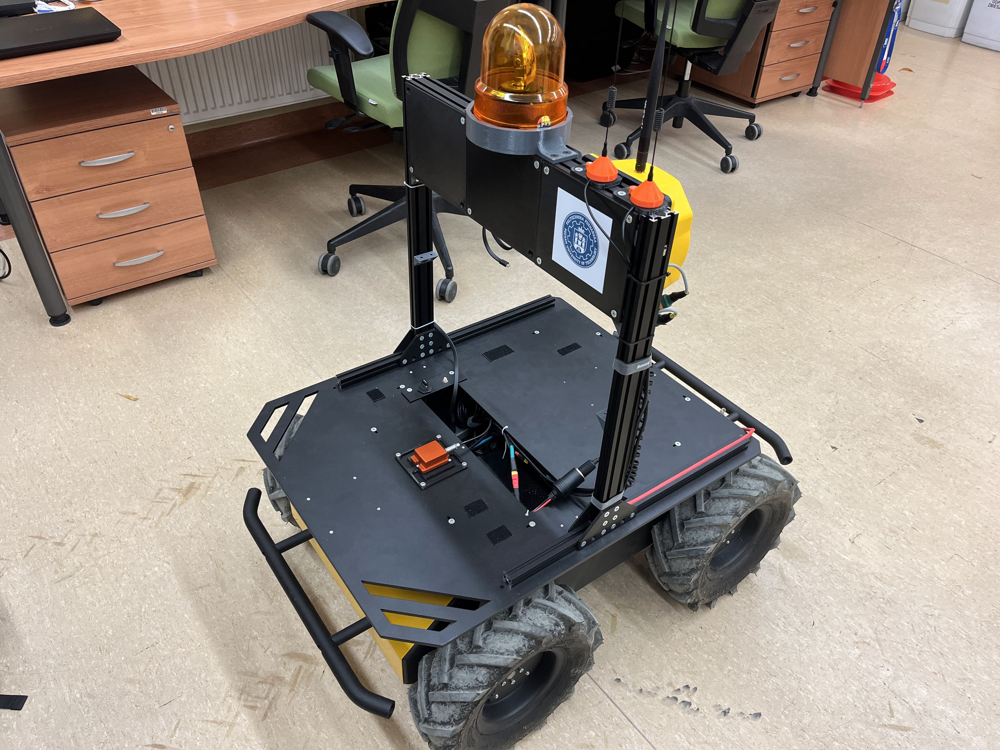
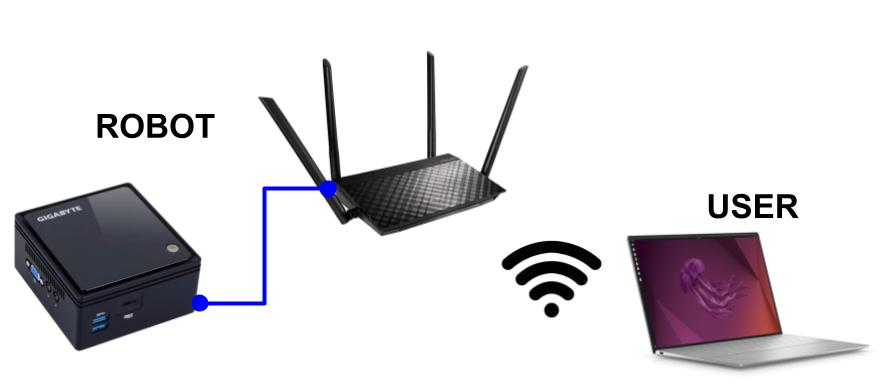
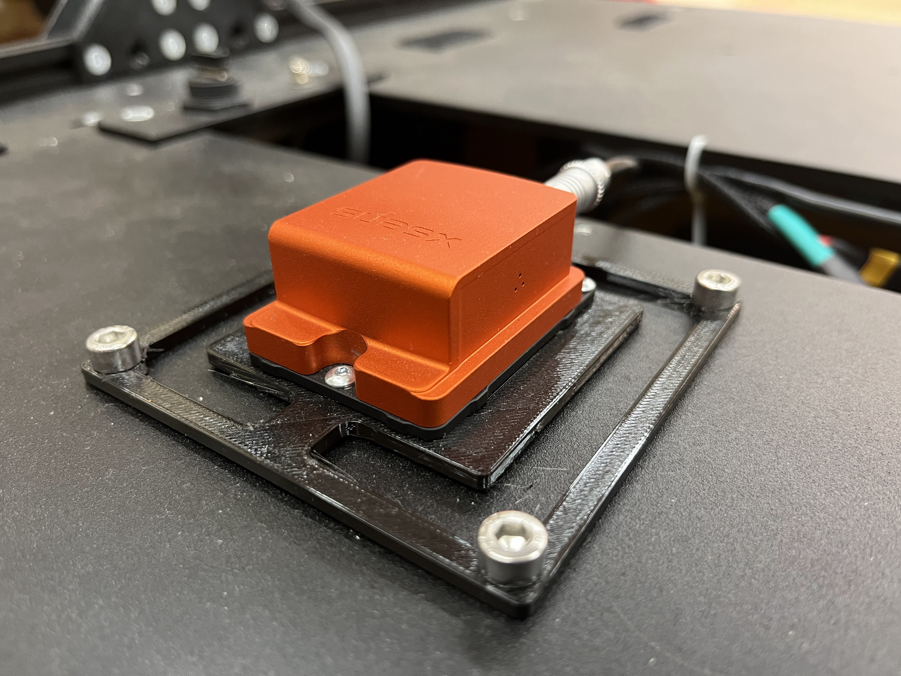

# Setup robot



## Install ROS

Prepare your robot according to the instructions in the Clearpath tutorial [here](https://clearpathrobotics.com/assets/guides/foxy/husky/index.html). You should have Ubuntu 20.04 and ROS2 Foxy installed before following the tutorial.

## Network

### Basic network structure
 


Make sure that the onboard router has access to the internet during the setup.

Depending on your router and onboard PC you may need to follow instructions included in [NETWORK](NETWORK.md) section.

To follow with this instruction you don't have to follow official guidelines for setting network presented in [Clearpath documentation](https://clearpathrobotics.com/assets/guides/foxy/husky/HuskyNetwork.html).

## Sensors

All sensors connected to the robot should be correctly identified at the startup to avoid serial port conflicts. If you want to connect new sensor over USB port, follow the instructions in the [SENSORS](SENSORS.md).

# Setup software

## Husky packages

Packages can be built both on the onboard PC and user PC, however certain operations apply only to onboard PC.

### Build workspace
```sh
mkdir -p ~/put_husky_ws/src
cd ~/put_husky_ws/src
git clone https://github.com/PPI-PUT/put-husky.git
cd ..
rosdep install --from-paths src --ignore-src --rosdistro=$ROS_DISTRO -y
colcon build --symlink-install
source install/setup.bash
echo "source /opt/ros/foxy/setup.bash" >> ~/.bashrc
echo "source ~/put_husky_ws/install/setup.bash" >> ~/.bashrc
source ~/.bashrc
```

### Setup udev rules
```sh
source ~/.bashrc
sudo cp $(rospack find husky_bringup)/udev/* /etc/udev/rules.d/
sudo cp $(rospack find husky_bringup)/debian/* /etc/udev/rules.d/

sudo udevadm control --reload-rules && sudo service udev restart && sudo udevadm trigger
```

## IMU integration

We use Xsens MTi-300 IMU for measurements.



### Build workspace

```sh
mkdir -p ~/xsens_ws/src
cd ~/xsens_ws/src
git clone -b foxy-husky https://github.com/PPI-PUT/bluespace_ai_xsens_ros_mti_driver.git
cd ..
rosdep install --from-paths src --ignore-src --rosdistro=$ROS_DISTRO -y
colcon build --symlink-install
source install/setup.bash
echo "source ~/xsens_ws/install/setup.bash" >> ~/.bashrc
source ~/.bashrc
```

### Setup udev rules
```sh
source ~/.bashrc
sudo cp $(rospack find bluespace_ai_xsens_ros_mti_driver)/udev/* /etc/udev/rules.d/
sudo udevadm control --reload-rules && sudo service udev restart && sudo udevadm trigger
```

## Startup install
Run below script only on robot to enable ROS packages at the robot startup.
```sh
source ~/.bashrc
ros2 run husky_bringup install
ros2 run bluespace_ai_xsens_ros_mti_driver install
```
To verify installation you can run
```sh
journalctl -a -b | grep ros
```
to make sure no errors occured during startup. You can compare you out put with ours at [example_output.md](example_output.md).

## Visualization
_TODO_


